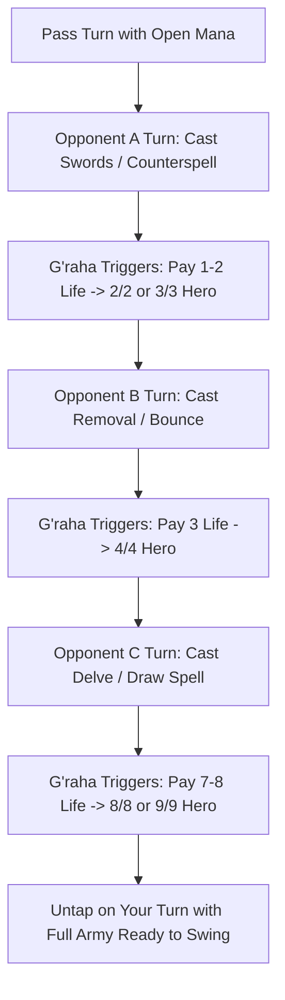

# G'raha Tia, Scion Reborn — Discussion & Architectural Blueprint

**Deck:** Crystal Tower Defense / The Scion's Armory  
**Commander:** [G'raha Tia, Scion Reborn](https://scryfall.com/card/fic/3/graha-tia-scion-reborn) ({W}{U}{B})  
**Format:** Commander / EDH  
**Color Identity:** Esper ({W}{U}{B})  
**Target Power Bracket:** Bracket 3 (High-Synergy Engine / Optimized Casual Control)  
**Date:** 2026-09-19  

---

## 1. Executive Summary & The Control Paradox

Traditional Esper control commanders frequently struggle in 4-player Commander with the "Finisher Paradox":
1. Packing heavy, high-cost finishers (e.g., consecrated sphinxes, giant demons) dilutes the interaction suite and causes awkward early hands.
2. Relying entirely on generic two-card infinite combos (e.g., Thassa's Oracle + Demonic Consultation) draws high pod salt and homogenizes deck gameplay.
3. Pure Draw-Go control without dedicated win conditions leads to sluggish 2-hour grinds where the control player stalls the game but cannot close it out.

**G'raha Tia, Scion Reborn completely breaks this paradox:**
```
G'raha Tia, Scion Reborn — {W}{U}{B}
Legendary Creature — Cat Wizard (2/3)
Lifelink
Throw Wide the Gates — Whenever you cast a noncreature spell, you may pay X life, 
where X is that spell's mana value. If you do, create a 1/1 colorless Hero creature 
token and put X +1/+1 counters on it. Do this only once each turn.
```

With G'raha Tia, **your defensive interaction is your win condition.** Every removal spell, counterspell, cantrip, mana rock, equipment, or board wipe you cast passively fabricates a towering, offensive beatstick. You never need to tap out on your main phase to build an army.

---

## 2. The Core Mechanical Engine & Rules Exploits

To optimize any G'raha Tia build, the pilot must exploit five critical rules interactions:

### A. The "Once Each Turn" Clock (The 4-Turn Cycle)
* The card reads: *"Do this only once each turn."*
* It does **not** state "once during each of your turns." In a 4-player pod, there are four separate turns in every turn cycle.
* By playing at instant speed or leveraging flash enablers, G'raha can trigger on **Turn Opponent A, Turn Opponent B, Turn Opponent C, and Your Turn**, generating up to **four massive Hero tokens per round**.

### B. Mana Value (MV) vs. Mana Spent (Cost Cheating)
* The ability dictates: *"where X is that spell's mana value."*
* G'raha calculates $X$ strictly from the printed **mana value on the stack**, completely ignoring how much mana was actually spent to cast it.
* **Delve:** Casting [Dig Through Time](https://scryfall.com/card/uma/50/dig-through-time) ({6}{U}{U}) for {U}{U} delves away 6 cards, but its printed MV is 8. Pay 8 life $\rightarrow$ create a **9/9 Hero token** at instant speed.
* **Convoke:** Casting [Hour of Reckoning](https://scryfall.com/card/cmd/15/hour-of-reckoning) ({4}{W}{W}{W}) tapping tokens pays {W}{W}{W}, but MV is 7. Pay 7 life $\rightarrow$ create an **8/8 Hero token**.
* **Free / Pitch Spells:** [Deadly Rollick](https://scryfall.com/card/c20/42/deadly-rollick) (MV 4), [Fierce Guardianship](https://scryfall.com/card/c20/35/fierce-guardianship) (MV 3), and [Snuff Out](https://scryfall.com/card/gvl/53/snuff-out) (MV 4) cast for {0} mana while triggering G'raha for 4/4 and 5/5 Heroes.
* **Flashback:** [Echo of Eons](https://scryfall.com/card/mh1/46/echo-of-eons) cast from the graveyard for {2}{U} retains its printed stack MV of 6 $\rightarrow$ pay 6 life to make a **7/7 Hero token** and wheel for 7 cards!

### C. Token Characteristics (Colorless & Modified)
* Each token enters as a **1/1 colorless Hero creature token with $X$ $+1/+1$ counters** (base size $(1+X)/(1+X)$).
* **Colorless Immunity:** They dodge colored-board wipes like [All Is Dust](https://scryfall.com/card/uma/1/all-is-dust) and [Ugin, the Spirit Dragon](https://scryfall.com/card/m21/1/ugin-the-spirit-dragon).
* **Naturally Modified:** Because they enter with $+1/+1$ counters, they satisfy all "modified creature" rules (e.g., [Envoy of the Ancestors](https://scryfall.com/card/mh3/23/envoy-of-the-ancestors) granting them passive Lifelink).

### D. The Token Mana Value Zero Rule
* In Magic, **tokens have a mana value of 0** (unless they are token copies of a card with a mana cost).
* Even if a Hero token enters as an 8/8 or 12/12 with counters, its mana value is 0.
* Therefore, effects that care about creatures entering with MV $\le 3$ (such as [Tocasia's Welcome](https://scryfall.com/card/bro/30/tocasias-welcome)) trigger on **every single Hero token G'raha creates**, regardless of how gigantic it is.

### E. The Life Economy
* Paying 4–8 life repeatedly will bleed out a 40-life pool in two turn cycles.
* G'raha has natural Lifelink (2/3), but the deck requires dedicated lifegain arbitrage, mass-lifelink enablers, or life-reset mechanisms to transform life payment from a liability into an engine.

---

## 3. Four Architectural Approaches

---

### Variant A: The Draw-Go Flash Spellslinger (The 4-Turn Cycle Engine)

* **Archetype:** Instant-Speed Reactive Control / Delve Spellslinger
* **Core Philosophy:** Never tap out on your main phase. Hold up open mana, respond defensively to threats across the table, and let G'raha assemble an army of blockers and attackers during everyone else's turns.



#### Key Cards for Variant A
* **[Tocasia's Welcome](https://scryfall.com/card/bro/30/tocasias-welcome) ({2}{W}):** Draws a card whenever a creature with MV $\le 3$ enters (once each turn). Because Hero tokens have MV 0, this triggers on Opponent A's turn, Opponent B's turn, Opponent C's turn, and your turn—drawing up to 4 cards per cycle!
* **[Bender's Waterskin](https://scryfall.com/card/tla/254/benders-waterskin) ({3}):** Untaps during **each other player's untap step**; taps for one mana of any color. Provides 3 free mana every turn cycle to fuel instant-speed interaction on opponents' turns.
* **[Into the Story](https://scryfall.com/card/eld/50/into-the-story) ({5}{U}{U}):** Instant. Costs {2}{U}{U} if an opponent has 7+ cards in graveyard. Printed MV is 7. Pay 7 life $\rightarrow$ **draw 4 cards and create an 8/8 Hero token** at the end of an opponent's turn!
* **[Dig Through Time](https://scryfall.com/card/uma/50/dig-through-time) & [Treasure Cruise](https://scryfall.com/card/ktk/59/treasure-cruise):** Delve away spent cantrips to cast for {U}{U} or {U}, paying 8 life to create **9/9 Hero tokens**.
* **[Temporal Trespass](https://scryfall.com/card/frf/55/temporal-trespass) ({8}{U}{U}{U}):** Delve for {U}{U}{U} $\rightarrow$ pay 11 life to create a **12/12 Hero token** and immediately take an extra turn to attack with it.
* **[Cover of Darkness](https://scryfall.com/card/ons/133/cover-of-darkness) ({1}{B}):** Choose **"Hero"**. Grants Fear to all Heroes, preventing opponents from chump-blocking your 8/8 and 9/9 beatsticks with 1/1 tokens.
* **[Ral Zarek, Guest Lecturer](https://scryfall.com/card/sos/112/ral-zarek-guest-lecturer) ({1}{B}{B}):** Mono-Black planeswalker (*Secrets of Strixhaven*). His $-2$ reanimates a creature with MV $\le 3$ directly from graveyard to battlefield. Because G'raha's MV is 3, Ral brings your commander back for free, bypassing commander tax!
* **[Avengers Assemble!](https://scryfall.com/card/fic/10/avengers-assemble) ({4}{W}):** Flash enchantment. Heroes get $+2/+2$. At the beginning of *each* end step, if a Hero entered under your control or attacked, draw a card!

---

### Variant B: "The Scion's Armory" (Artifacts & Job Select Equipment)

* **Archetype:** Artifact Control / Modular Equipment Voltron-Swarm
* **Core Philosophy:** Exploit the built-in "Double Hero" cast loop of Final Fantasy *Job Select* equipment. Flash in equipment during combat to create surprise blockers and assemble an impenetrable wall of armed champions.

```
[Cast Job Select Equipment (Artifact)] 
       │
       ├──> 1. G'raha Cast Trigger: Pay X Life ──> Create a tall (1+X)/(1+X) Hero with counters
       │
       └──> 2. Equipment Resolves & Enters ────> Job Select creates a 1/1 Hero & equips to it!
```

#### Key Cards for Variant B
* **[Leyline of Anticipation](https://scryfall.com/card/clb/726/leyline-of-anticipation) ({2}{U}{U}):** The engine linchpin. Allows you to cast all equipment, mana rocks, and artifacts at instant speed across opponents' turns, turning sorcery-speed weapons into surprise combat tricks.
  * *Redundancy:* [Shimmer Myr](https://scryfall.com/card/nec/157/shimmer-myr), [Liberator, Urza's Battlethopter](https://scryfall.com/card/bro/237/liberator-urzas-battlethopter), [Raff Capashen, Ship's Mage](https://scryfall.com/card/dom/202/raff-capashen-ships-mage).
* **[Machinist's Arsenal](https://scryfall.com/card/fic/8/machinists-arsenal) ({4}{W}):** Job Select equipment (MV 5). G'raha creates a 6/6 Hero; Job Select creates a 1/1 Hero and equips. Equipped creature gets **$+2/+2$ for each artifact you control**! Easily creates a 20/20+ lethal threat.
* **[Dancer's Chakrams](https://scryfall.com/card/fic/5/dancers-chakrams) ({3}{W}):** Job Select equipment (MV 4). G'raha makes a 5/5 Hero; equips 1/1 Hero with $+2/+2$ and Lifelink, and grants *"Other commanders you control get $+2/+2$ and have lifelink"*, converting G'raha into a 4/5 Lifelink powerhouse.
* **[Ashe, Princess of Dalmasca](https://scryfall.com/card/fic/4/ashe-princess-of-dalmasca) ({2}{W}):** Attacks to dig 5 cards deep and put an artifact card into your hand every turn, protected by your tall Heroes.
* **[Elena, Turk Recruit](https://scryfall.com/card/fic/20/elena-turk-recruit) ({2}{W}):** Enters to return any historic card (artifact, legendary, Saga) from graveyard to hand; grows with $+1/+1$ counters whenever you cast historic spells.
* **[Fomori Vault](https://scryfall.com/card/big/29/fomori-vault) (Land):** `{3}, {T}`, Discard a card: Look at the top $X$ cards of your library, where $X$ is the number of artifacts you control. In an artifact-heavy shell ($X \ge 10$), Fomori Vault is an uncounterable, instant-speed Tutor-10 on a land.
* **[Inspiring Statuary](https://scryfall.com/card/mkc/230/inspiring-statuary) ({3}):** Grants your non-artifact spells Improvise. Tapping an equipment does not un-attach it or remove its abilities, allowing you to tap your armory to cast counterspells and card draw for free.
* **[Puresteel Paladin](https://scryfall.com/card/cmm/51/puresteel-paladin) ({W}{W}):** Draws a card whenever any equipment enters the battlefield; grants {0} equip costs with Metalcraft.
* **[Skullclamp](https://scryfall.com/card/moc/379/skullclamp) ({1}):** Attach to the 1/1 Hero generated by Job Select for {1} $\rightarrow$ draws 2 cards!

> [!NOTE]
> **Token Type Ruling:** Hero tokens are colorless creatures, **not** artifact creatures. Artifact counts for Fomori Vault, Affinity, and Machinist's Arsenal are powered by the equipment, mana rocks, and artifact lands themselves (or via [Encroaching Mycosynth](https://scryfall.com/card/one/47/encroaching-mycosynth)).

---

### Variant C: "Life as Currency" (Lifegain Arbitrage & Masochism Engine)

* **Archetype:** Lifegain Control / Life-Payment Burn & Drain
* **Core Philosophy:** Solve G'raha's life drain by turning lifegain into a massive surplus. Trigger G'raha without hesitation, profit net life on every token entry, and weaponize your high life total to incinerate opponents.

#### Key Cards for Variant C
* **[Angelic Chorus](https://scryfall.com/card/bbd/87/angelic-chorus) ({3}{W}{W}) — *The Absolute MVP*:**
  * *"Whenever a creature you control enters, you gain life equal to its toughness."*
  * When G'raha creates a token from an $X$-cost spell, the token has toughness **$X+1$**.
  * You pay $X$ life to cast $\rightarrow$ token enters $\rightarrow$ you gain $(X+1)$ life!
  * **You net $+1$ life on every single cast!** High-MV spells become completely free of life cost and actively grow your life total.
* **[Envoy of the Ancestors](https://scryfall.com/card/mh3/23/envoy-of-the-ancestors) ({2}{W}):**
  * *"Modified creatures you control have lifelink."*
  * Because G'raha places counters on every Hero token, **all of your Hero tokens gain Lifelink passively**. An 8/8 Hero attacking or blocking instantly heals you for 8 life.
* **[Whip of Erebos](https://scryfall.com/card/ths/110/whip-of-erebos) ({2}{B}{B}):** Enchantment (triggers G'raha). Grants all creatures Lifelink; late-game reanimation sink.
* **[Sanguine Bond](https://scryfall.com/card/c21/153/sanguine-bond) ({3}{B}{B}) & [Enduring Tenacity](https://scryfall.com/card/dsk/95/enduring-tenacity) ({2}{B}{B}):**
  * Whenever you gain life, target opponent loses that much life.
  * Swing with an 8/8 Lifelink Hero $\rightarrow$ deal 8 combat damage, gain 8 life, and drain another 8 life $\rightarrow$ **16 damage from a single attack**!
* **[Vito, Thorn of the Dusk Rose](https://scryfall.com/card/m21/127/vito-thorn-of-the-dusk-rose) ({2}{B}):** Redundant life-gain drain on a 3-drop body with a {3}{B}{B} team-lifelink activator.
* **[Aetherflux Reservoir](https://scryfall.com/card/kld/192/aetherflux-reservoir) ({4}):** Artifact (triggers G'raha). With your life total effortlessly crossing 60–80+, laser-beam opponents for 50 damage at instant speed.
* **[Bolas's Citadel](https://scryfall.com/card/war/79/bolass-citadel) ({3}{B}{B}{B}):** Play cards off the top of your library by paying life equal to their mana values. In a deck with 70+ life, this enables explosive storm turns, triggering G'raha and flooding the board.
* **[The Gaffer](https://scryfall.com/card/ltc/12/the-gaffer) ({2}{W}) & [Well of Lost Dreams](https://scryfall.com/card/c21/275/well-of-lost-dreams) ({4}):** Card advantage engines that convert your regular lifegain into overflowing hands.
* **[Archangel of Thune](https://scryfall.com/card/2xm/5/archangel-of-thune) ({3}{W}{W}):** Puts a $+1/+1$ counter on *each* creature you control whenever you gain life, causing your board of Heroes to grow exponentially.
* **[Aerith Gainsborough](https://scryfall.com/card/fic/2/aerith-gainsborough) ({2}{W}):** Lifelink; grows with $+1/+1$ counters on lifegain. When she dies, transfers all counters to legendary creatures—supercharging G'raha into commander-damage lethal range!
* **[Excalibur II](https://scryfall.com/card/fic/148/excalibur-ii) ({1}):** Legendary Equipment. Gets charge counters whenever you gain life; equipped creature gets $+1/+1$ per charge counter.

---

### Variant D: Asymmetrical Colorless & Token Board-Wipe Control

* **Archetype:** Parity-Breaking Stax / Asymmetrical Board Wipe Control
* **Core Philosophy:** Capitalize on the fact that Hero tokens are **colorless** and **tokens**. Run sweepers that wipe colored permanents or non-token creatures, leaving your entire army standing alone on the battlefield.

#### Key Cards for Variant D
* **[All Is Dust](https://scryfall.com/card/uma/1/all-is-dust) ({7}):** Tribal Sorcery — Eldrazi.
  * Cast All Is Dust $\rightarrow$ G'raha triggers: pay 7 life $\rightarrow$ create an **8/8 colorless Hero token**.
  * All Is Dust resolves: Each player sacrifices all colored permanents they control.
  * Opponents lose their entire boards. G'raha dies, but your **colorless Hero tokens and colorless artifacts are completely untouched!** You untap with an 8/8 and sweep the game.
* **[Ugin, the Spirit Dragon](https://scryfall.com/card/m21/1/ugin-the-spirit-dragon) ({8}):** Casting Ugin triggers G'raha for a **9/9 Hero**. Ugin's $[-X]$ exiles colored permanents of MV $X$ or less; your colorless Heroes are completely immune.
* **[Hour of Reckoning](https://scryfall.com/card/cmd/15/hour-of-reckoning) ({4}{W}{W}{W}):** Convoke. "Destroy all non-token creatures." Pay 7 life to create an 8/8 Hero, tap existing tokens to reduce the cost to {W}{W}{W}, and wipe all non-token creatures while your entire Hero army survives!
* **[Forsaken Monument](https://scryfall.com/card/znr/244/forsaken-monument) ({5}):** Artifact. Colorless creatures get $+2/+2$ (turning an 8/8 into a 10/10), colorless mana sources tap for extra {C}, and you gain 2 life on colorless spell casts.
* **[Intangible Virtue](https://scryfall.com/card/ema/15/intangible-virtue) ({1}{W}):** Grants all tokens $+1/+1$ and **Vigilance**, allowing you to swing with giant Heroes without dropping your shields.

---

## 4. Cross-Variant Tech & Flavor Hall of Fame

Regardless of which primary shell you pilot, several cross-cutting cards provide unmatched synergy and flavor:

### FFXIV Lore Highlights
* **[Emet-Selch of the Third Seat](https://scryfall.com/card/fic/18/emet-selch-of-the-third-seat) ({2}{U}{B}):** Spells cast from graveyard cost {2} less. Whenever an opponent loses life, cast an instant or sorcery from your graveyard (once each turn). Recasting from the yard triggers G'raha!
* **[Cecil, Dark Knight // Cecil, Redeemed Paladin](https://scryfall.com/card/fic/12/cecil-dark-knight) ({B}):** Cecil flips when your life is $\le 20$. In a deck where G'raha actively spends life, Cecil flips effortlessly, gaining Lifelink and making all your attacking Hero tokens **Indestructible**!
* **[Fandaniel, Telophoroi Ascian](https://scryfall.com/card/fic/22/fandaniel-telophoroi-ascian) ({4}{B}):** Every instant/sorcery Surveils 1. At your end step, opponents must sacrifice a nontoken creature or take 2 damage per instant/sorcery in your graveyard.

### Engine Tech Pieces
* **[The Ozolith](https://scryfall.com/card/iko/237/the-ozolith) ({1}) & [Resourceful Defense](https://scryfall.com/card/ncc/19/resourceful-defense) ({2}{W}):** If an opponent kills an 8/8 Hero token, all 8 counters move onto The Ozolith. At combat on your turn, dump all 8 counters onto **G'raha Tia**, converting him into a 10/11 Lifelink commander lethal threat!
* **[Danny Pink](https://scryfall.com/card/who/39/danny-pink) ({3}{U}):** Grants creatures: *"Whenever one or more counters are put on this creature for the first time each turn, draw a card."* Draws a card on **every single Hero token G'raha creates**, including across opponents' turns.
* **[Children of Korlis](https://scryfall.com/card/tsp/8/children-of-korlis) ({W}) & [Tainted Sigil](https://scryfall.com/card/arb/83/tainted-sigil) ({1}{W}{B}):** Sacrifice to gain back all life you lost this turn, acting as emergency "undo buttons" after massive life-spending turns.

---

## 5. Architectural Comparison & Pod Recommendation

| Variant | Speed & Ramp | Board Durability | Fun / Novelty Factor | Pod Salt Risk | Recommended Power Tier |
| :--- | :---: | :---: | :---: | :---: | :---: |
| **A: Flash Spellslinger** | Medium-Fast | High (Instant Shields) | Very High (Active every turn) | Low-Medium (Honest control) | Bracket 3–4 (Optimized) |
| **B: Scion's Armory** | Fast (Affinity/Rocks) | Medium-High (Ward/Equipment) | Extremely High (Job Select flavor) | Very Low (Combat-oriented) | Bracket 2–3 (Mid-Power) |
| **C: Lifegain Arbitrage** | Medium | Very High (High Life Pool) | High (Big numbers & burn) | Medium (Aetherflux/Citadel) | Bracket 3 (Optimized Casual) |
| **D: Colorless Sweepers** | Slow-Control | Maximum (One-sided wipes) | Medium | High (Board wipe fatigue) | Bracket 3 (Hard Control) |

### The Verdict for Atelier / Local Pod
For the most dynamic, engaging, and enjoyable experience across the local pod:
* **The Hybrid "Scion's Armory + Lifegain" Build:** Blending **Variant B** (Job Select equipment, `Elena`, `Ashe`, `Leyline of Anticipation`, `Fomori Vault`) with the core lifegain stabilizers of **Variant C** (`Angelic Chorus`, `Envoy of the Ancestors`, `Dancer's Chakrams`) provides:
  1. Deep Universes Beyond FFXIV thematic resonance.
  2. The fun of creating two Heroes per cast (tall + equipped).
  3. Zero fear of life-drain penalties thanks to Angelic Chorus and modified Lifelink.
  4. Active, engaging turns during opponents' rounds without inducing "hard stax / infinite combo" fatigue.
